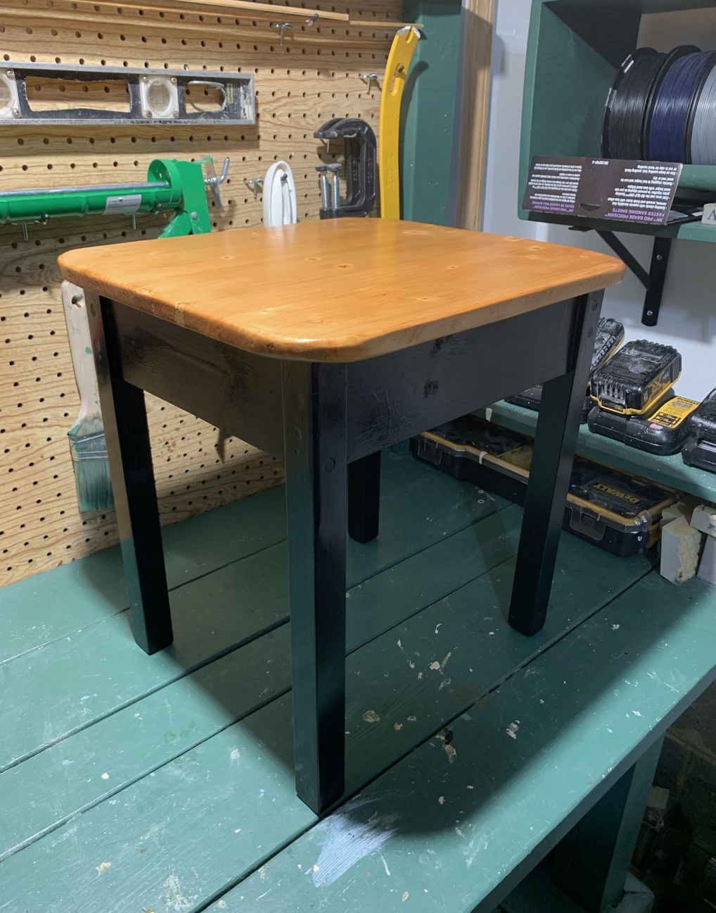

# Vanity Bench

This repo has the plans and some pictures of the vanity bench I recently built in my YouTube video at:

The bench I built is a replacement for a somewhat squeaky and less stable bench that came with a Vanity.

The `Board Dimensions.pdf` file has the individual board sizes.

The `Board Layout.pdf` has some dimensions I used to assemble it.

I also used a [Black and Decker Workmate 425](https://www.homedepot.com/p/BLACK-DECKER-Workmate-425-30-in-Folding-Portable-Workbench-and-Vise-WM425/202516382?cm_mmc=SOCIAL|PIP|Internal||emailafriend|202516382&cm_mmc=ecc-_-THD_EMAIL_A_FRIEND-_-V1_M1_CA-_-VIEW_ITEM&ecc_id=666aab71b1c86cd332df08ce87ece78765924574a86d7dcb2e928444269477d2) to assemble this project. Its a great tool and very versatile for things like this.

Check out the pictures of the finished product as well.

- [Finished Product](./FINISHED_PRODUCT.png)
- [Compare Old Bench vs New](./COMPARE_OLD_VS_NEW.png)
- [Half Finished](./HALF_FINISHED.png)
- [Painting](./PAINTING.png)

If you have any questions, or would like to learn more you can find me at [@AndrewEvans0102](https://www.twitter.com/AndrewEvans0102) as well as at [andrewevans.dev](https://www.andrewevans.dev).
